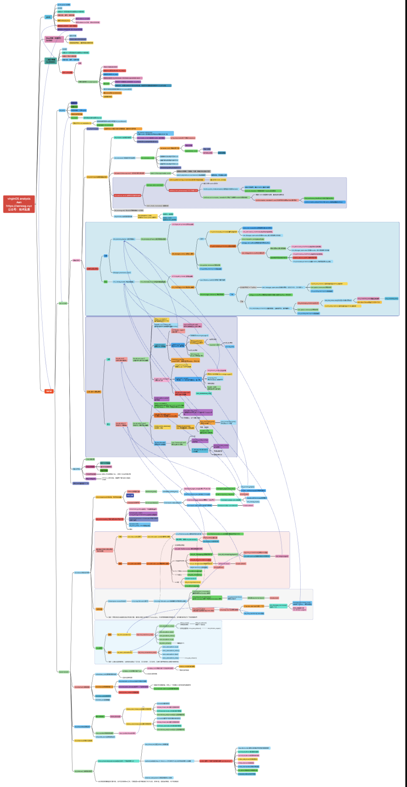

# virginOS

> [https://aeneag.xyz](https://aeneag.xyz/)
>
> Aen
>
> 2022/05/25

## introduction

A simple operating system based on x86.

## link

github   [https://github.com/aeneag/virginOS](https://github.com/aeneag/virginOS)

gitee     [https://gitee.com/aeneag/virginOS](https://gitee.com/aeneag/virginOS)

note      [https://aeneag.xyz/virginOS](https://aeneag.xyz/virginOS) If you want to look at the notes，here

## catalog

**backup_file** directory saves  the project files

- c_virginOS_13_end
- c_virginOS_18_end
- c_virginOS_21_end
- c_virginOS_26_end
- c_virginOS_30_end
- c_virginOS_34_end
- c_virginOS_41_end

**images** directory saves the picture and mp4 files

## tutorial

Download a project, enter the current project, and execute:

```shell
make
```

or

```shell
make vboxtest
```

You can view notes using VM VirtualBox for details , ------>  [https://aeneag.xyz/virginOS](https://aeneag.xyz/virginOS) 

## note

**[## 从零到一手写操作系统（二、环境配置）](https://aeneag.xyz/articles/2022/03/27/1648377968693.html)**

**[## 从零到一手写操作系统（三、总体框架设计）](https://aeneag.xyz/articles/2022/03/28/1648458002900.html)**

**[## 从零到一手写操作系统（四、硬件知识 1）CPU工作模式）](https://aeneag.xyz/articles/2022/03/29/1648529207107.html)**

**[## 从零到一手写操作系统（四、硬件知识 2）地址转换）](https://aeneag.xyz/articles/2022/03/29/1648530290278.html)**

**[## 从零到一手写操作系统（四、硬件知识 3）Cache与内存）](https://aeneag.xyz/articles/2022/03/29/1648531064772.html)**

**[## 从零到一手写操作系统（五、同步 1）原子中断锁信号量）](https://aeneag.xyz/articles/2022/03/29/1648556903227.html)**

**[## 从零到一手写操作系统（五、同步 2）linux的实现）](https://aeneag.xyz/articles/2022/03/29/1648558476495.html)**

**[## 从零到一手写操作系统（六、初始化 1）工作模式与环境）](https://aeneag.xyz/articles/2022/04/05/1649156057224.html)**

**[## 从零到一手写操作系统（六、初始化 2）hal层）](https://aeneag.xyz/articles/2022/04/09/1649509524027.html)**

**[## 从零到一手写操作系统（六、初始化 3）linux初始化）](https://aeneag.xyz/articles/2022/04/13/1649863127290.html)**

**[## 从零到一手写操作系统（七、内存 1）划分与初始化）](https://aeneag.xyz/articles/2022/04/13/1649863448611.html)**

**[## 从零到一手写操作系统（七、内存 2）内存的分配与释放）](https://aeneag.xyz/articles/2022/04/15/1649991558966.html)**

**[## 从零到一手写操作系统（七、内存 3）内存对象的分配与释放）](https://aeneag.xyz/articles/2022/04/20/1650422198786.html)**

**[## 从零到一手写操作系统（七、内存 4）虚拟内存的分配与释放）](https://aeneag.xyz/articles/2022/04/26/1650936144579.html)**

**[## 从零到一手写操作系统（七、内存 5）linux buddy system）](https://aeneag.xyz/articles/2022/04/26/1650937159158.html)**

**[## 从零到一手写操作系统（七、内存 6）linux slab）](https://aeneag.xyz/articles/2022/04/26/1650938130943.html)**

**[## 从零到一手写操作系统（八、进程 1）进程实现）](https://aeneag.xyz/articles/2022/05/06/1651826447512.html)**

**[## 从零到一手写操作系统（八、进程 2）linux 进程）](https://aeneag.xyz/articles/2022/05/06/1651826819269.html)**

**[## GDB+QEMU调试](https://aeneag.xyz/articles/2022/05/07/1651914235439.html)**

**[## 从零到一手写操作系统（九、驱动与设备 1）设计与实现）](https://aeneag.xyz/articles/2022/05/09/1652098333998.html)**

**[## 从零到一手写操作系统（九、驱动与设备 2）linux获取设备信息）](https://aeneag.xyz/articles/2022/05/09/1652098601407.html)**

**[## 从零到一手写操作系统（十、文件系统 1）设计与实现）](https://aeneag.xyz/articles/2022/05/13/1652449177516.html)**

**[## 从零到一手写操作系统（十、文件系统 2）linux虚拟文件系统）](https://aeneag.xyz/articles/2022/05/13/1652449426669.html)**

**[## 从零到一手写操作系统（十一、网络 1）从URL到网卡，网络数据如何流动？）](https://aeneag.xyz/articles/2022/05/15/1652620596006.html)**

**[## 从零到一手写操作系统（十二、实现效果）](https://aeneag.xyz/articles/2022/05/25/1653468010920.html)**

## mind map



## result

https://pic.aeneag.xyz/virginOS/virginOS.mp4


## Contract me

Wechat Official Accounts


Wechat


